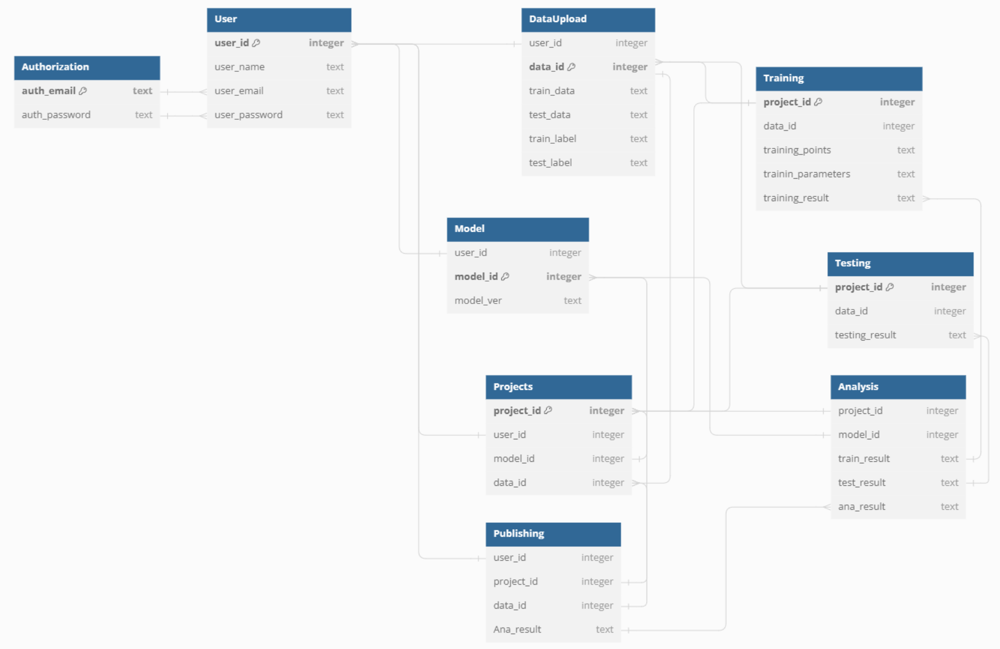

## EC530 Final Project
## Yi Shen
## Project:DIYML
In this project, I build my DIYML database and call the database using the API. The vast majority of the framing has now been erected. Due to time(The rpc report duo on May 3 and a final exam on May 7), many details have not been perfected. I will continue to improve this project afterwards. If you find something that needs to be changed and improved, please let me know. You can email me(yishen@bu.edu). Thank you!

### Database:
I use sqlite3 to build a database of DIYML. The structure of the result is shown in Fig 1
<div align=center>


Fig 1  Database structure
</div>

### API: 
The provided API script is a Flask-based application designed to interface with a SQLite database. It features various endpoints for managing data related to users, authorization, data uploads, projects, models, training, testing, and analysis. Below is a summary of the API's functionality:
1. User Management:
POST /user: Creates a new user if they are authorized. It checks the credentials against the authorization table and adds a new user if the credentials are authenticated.
GET /user/<user_id>: Retrieves details of a specific user based on their ID.
2. Authorization:
POST /create_auth: Allows creating a new authorization entry by adding email and password to the authorization table.
3. Data Management:
POST /upload_data: Uploads training and testing data for a user. Requires user ID and details of the data.
POST /create_model: Adds a new model entry linked to a user and versioning information.
POST /create_project: Creates a new project by associating a user with a model and data.
4. Training and Testing:
POST /add_training: Submits new training data including points, parameters, and results.
POST /add_testing: Submits testing results linked to specific data.
5. Results Analysis and Publishing:
POST /analyse_results/<product_id>: Analyzes results by fetching training and testing results, then generating a combined analysis report.
POST /publish: Publishes analysis results, requiring details about user, project, and data.
GET /publish, /publish/<int:user_id>, /publish/<int:user_id>/<int:project_id>: Retrieves published results either globally or filtered by user and project.
6. Additional Utilities:
GET /get_training/<int:product_id>, GET /get_testing/<int:product_id>: Fetches details of training and testing entries based on their IDs.
PUT /update_training_parameters/<int:product_id>: Updates training parameters for a specific training entry.
DELETE /delete_project/<int:project_id>, DELETE /delete_data/<int:data_id>, DELETE /delete_user/<int:user_id>: Deletes project, data, and user entries from the database, respectively.
7. Miscellaneous:
POST /submit_training: Enqueues a training task based on provided data. It uses an external function enqueue_training_task to handle the processing.

The API function is in API.py
The test result of API is in DIYML.ipynb

### data protection
Data protection is implemented using code in the API
```
c.execute("SELECT * FROM authorization WHERE auth_email = ? AND auth_password = ?", (email, password))
...
c.execute("INSERT INTO user (user_name, user_password, user_email) VALUES (?, ?, ?)", (name, password, email))
```
The results of testing its protection are (in DIYML.ipynb):
```
url = 'http://localhost:5000/user'

user_test = {
    'user_name': " or ""=",
    'user_password': " or ""=",
    'user_email': " or ""="
}

response = requests.post(url, json=user_test)
print('Status Code:', response.status_code)
print('Response Body:', response.json())

user_test2 = {
    'user_name': '105; DROP TABLE Suppliers',
    'user_password': '105; DROP TABLE Suppliers',
    'user_email': '105; DROP TABLE Suppliers'
}

response = requests.post(url, json=user_test)
print('Status Code:', response.status_code)

Result:
Status Code: 401
Response Body: {'error': 'Unauthorized access'}
Status Code: 401
Response Body: {'error': 'Unauthorized access'}
```

### pytest
The provided Python script in unit_test.py is a set of pytest tests designed to validate the functionality of a Flask application managing a SQLite database. Here’s a summary of the key components and tests:

1. test_post_user_authorized: Validates the creation of a new user with correct credentials. It expects a successful response (HTTP 201) and checks for a 'success' status in the response.
2. test_post_user_unauthorized: Attempts to create a user with incorrect credentials. It checks for an unauthorized status (HTTP 401) and expects an 'error' message in the response.
3. test_post_user_already_exists: Tries to create a duplicate user to test handling of conflicts. It expects a conflict response (HTTP 409) and checks for an 'error' message, indicating that the user already exists.
4. test_sql_injection_attempt_1 and test_sql_injection_attempt_2: These tests attempt to inject SQL commands to test the application’s vulnerability to SQL injection attacks. Both tests are designed to provoke an error response, check
<div align=center>


Fig 2  Unit test result
</div>

### Docker
Packaged and ready to install and run with docker. I run the pytest as a test of Docker.

<div align=center>


Fig 3  Unit test result
</div>

'docker exec -it strange_tharp sh' is used to create a new terminal in docker. The API can be called normally.
